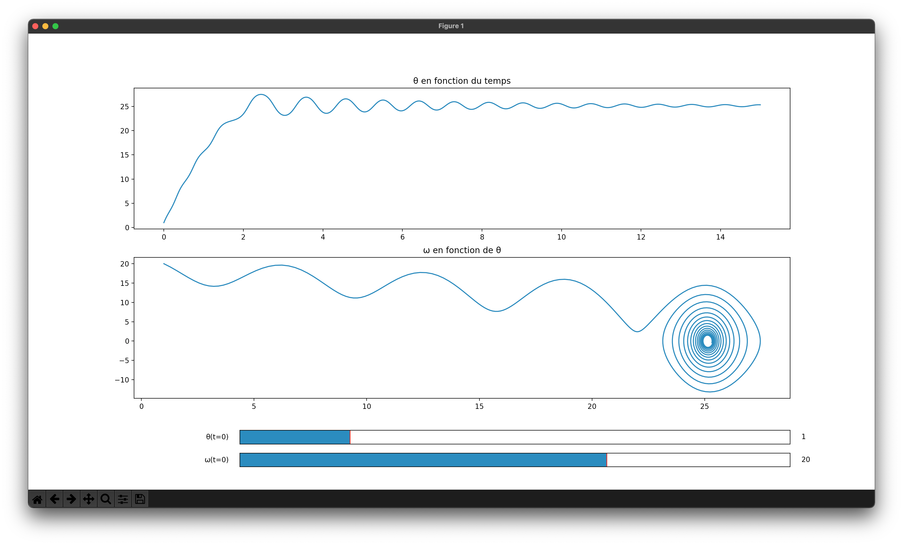

# TP 22

## Installation préalable

Modules requis :
- matplotlib
- numpy
- scipy

Installation :

```bash
python3 -m pip install matplotlib numpy scipy
```

## Exécution des scripts

### Pendule pesant

```bash
python3 pendule_pesant.py
```


